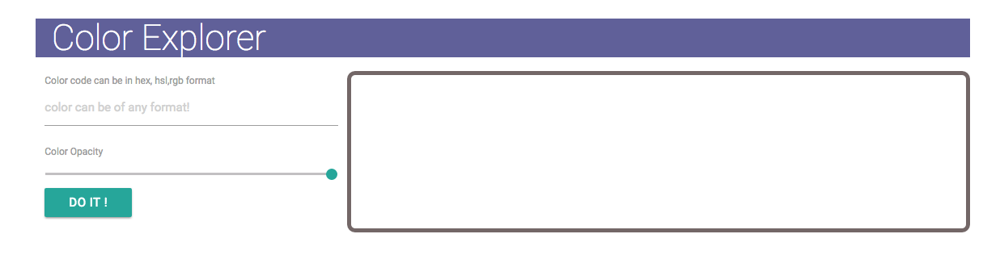
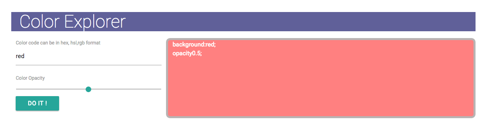

# CssBackgroundTool
This is a small tool that generates background color .

Here is the screen one 

Here is the Screen two

Add the color in the input box .  
The tool automatically generates css code . 
Just copy paste .

